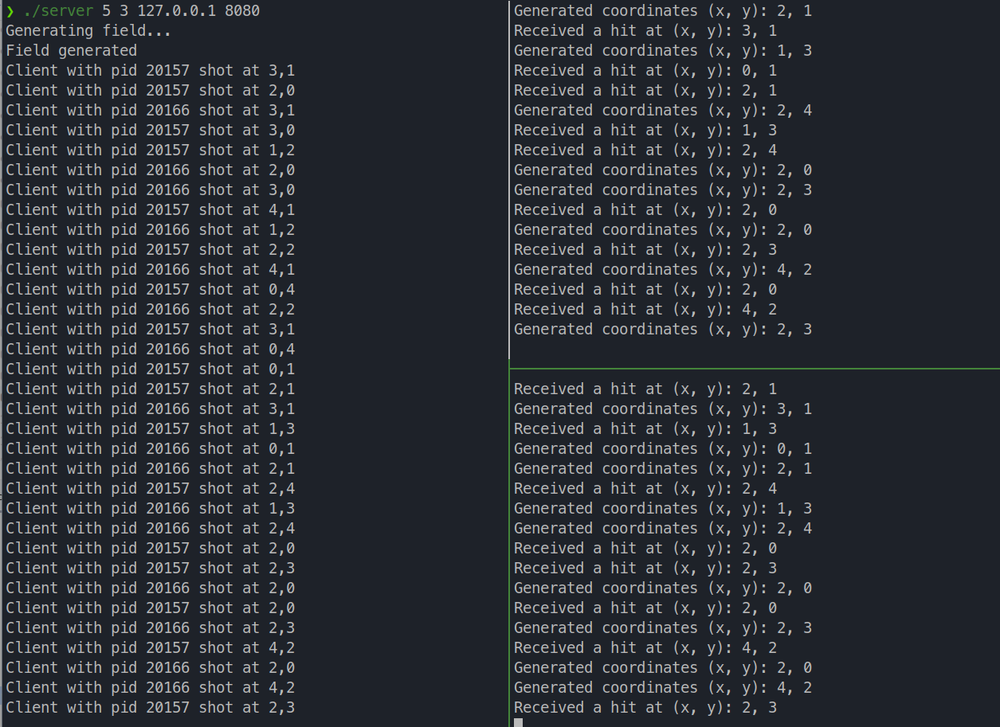

### Крупнов Иван Игоревич, БПИ 217, вариант 8

Анчуария и Тарантерия — два крохотных лати-
ноамериканских государства, затерянных в южных Андах. Дикта-
тор Анчуарии, дон Федерико, объявил войну диктатору Таранте-
рии, дону Эрнандо. У обоих диктаторов очень мало солдат, но очень
много снарядов для минометов, привезенных с последней амери-
канской гуманитарной помощью. Поэтому армии обеих сторон про-
сто обстреливают наугад территорию противника, надеясь пора-
зить минометы противника. Стрельба ведется хаотично до полного
уничтожения всех минометов противника, размещенных на некото-
рой прямоугольной площадке размером N*N. То есть координаты
целей, хоть и случайные, согласуются между разными минометчи-
ками одной армии (это предохраняет от стрельбы в одну и ту же
точку). Интервалы между выстрелами (задержки) зависят от рас-
стояния до точки попадания, формируемой случайно. Повторная
стрельба по одним и тем же координатам не производится. Коли-
чество минометов у каждой стороны одинаково и задается аргумен-
том командной строки. Размер поля также задается в командной
строке. Создать приложение, моделирующее военные дей-
ствия. Каждая страна — отдельный клиент. Сервер отвечает
за прием координат от клиентов и передает эти координаты дру-
гим клиентам. Он также получает информацию от клиентов об
их уничтожении. Расположение минометов порождается каж-
дым клиентом случайно.

### Сервер:

* Сервер начинает работу с создания поля боя и расстановки на нём миномётов для двух клиентов. В аргументах командной строки указывается размер поля и количество миномётов, а также адрес и порт сервера.
* Затем сервер создаёт сокет и привязывает его к определённому адресу и порту. Он переходит в режим прослушивания, ожидая входящие соединения от клиентов.
* После установления соединения сервер принимает координаты от клиентов (отправляемые как сообщения через сокет).
* При получении сообщения о выстреле, он отправляет сообщение о попадании обстрелянному клиенту.

### Клиент:

* Клиент начинает работу, устанавливая соединение с сервером. В аргументах командной строки указывается адрес и порт сервера. Каждый клиент представляет отдельную страну.
* Клиент генерирует случайные координаты на поле боя.
* Затем клиент отправляет эти координаты серверу.
* Клиент в отдельном потоке ожидает сообщения от сервера о попадании.
* Процесс повторяется бесконечно.
